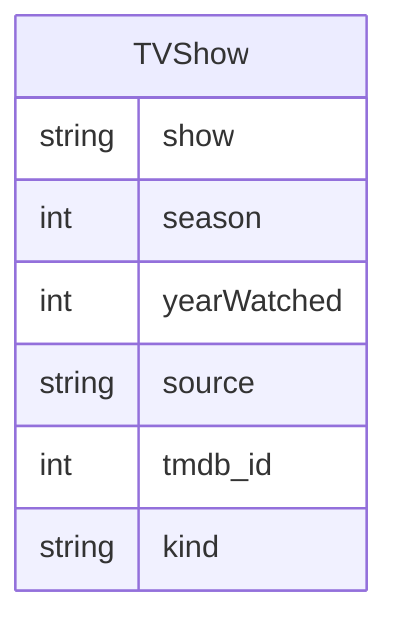

# TVShow Screen

## Description

User must be able to perform CRUD operations on TV Shows. A TV Show has the following fields:

Where:

* `show`: is the show name
* `season`: is the season number
* `yearWatched`: is the year the show was watched
* `source`: is the source of the show (e.g. Netflix, Amazon Prime, etc.)
* `tmdb_id`: is the TMDB ID of the show
* `kind`: is the kind of show (limited or regular)

## Acceptance Criteria

1. Code is clean
2. Tests are implemented and passing
3. Refer to `media000-spec.md` for additional requirements
